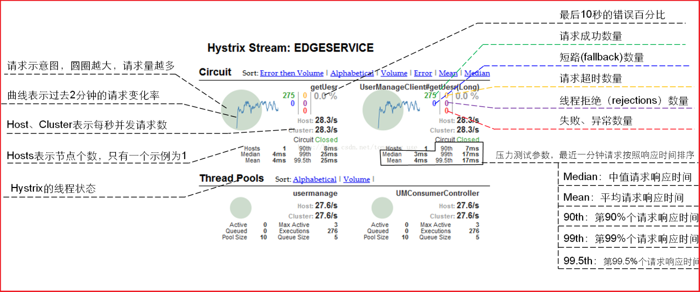

# study-hello-cloud
## 关于项目结构的一些注意点
我们在做电梯架构的时候,都是new Modules。但是在微服务架构下每个项目不是一个单独的服务。因为现在的开发模式并不是模块化开发,所以现在是创建目录继续进行开发。之前是一整个工程模块化,现在是每一个目录都是一个工程!

关于spring中#{}与${},可以这样联想记忆,"#"是四划"\$"是两划,#比\$牛逼啊,所以功能也更加强大,#中可以进行运算,而\$只能取值。

在mybatis中依旧是笔画多的牛皮,#{}能用来防止sql注入,而${}是纯粹的取值替换(包括''引号哦)!

## hello-spring-cloud-dependencies工程
Spring Cloud 项目都是基于 Spring Boot 进行开发，并且都是使用 Maven 做项目管理工具。在实际开发中，我们一般都会创建一个依赖管理项目作为 Maven 的 Parent 项目使用，这样做可以极大的方便我们对 Jar 包版本的统一管理。
### pom配置
```java
<?xml version="1.0" encoding="UTF-8"?>
<project xmlns="http://maven.apache.org/POM/4.0.0" xmlns:xsi="http://www.w3.org/2001/XMLSchema-instance"
         xsi:schemaLocation="http://maven.apache.org/POM/4.0.0 http://maven.apache.org/xsd/maven-4.0.0.xsd">
    <modelVersion>4.0.0</modelVersion>

    <parent>
        <groupId>org.springframework.boot</groupId>
        <artifactId>spring-boot-starter-parent</artifactId>
        <version>2.0.2.RELEASE</version>
    </parent>

    <groupId>com.funtl</groupId>
    <artifactId>hello-spring-cloud-dependencies</artifactId>
    <version>1.0.0-SNAPSHOT</version>
    <packaging>pom</packaging>

    <name>hello-spring-cloud-dependencies</name>
    <url>http://www.funtl.com</url>
    <inceptionYear>2018-Now</inceptionYear>

    <properties>
        <!-- Environment Settings -->
        <java.version>1.8</java.version>
        <project.build.sourceEncoding>UTF-8</project.build.sourceEncoding>
        <project.reporting.outputEncoding>UTF-8</project.reporting.outputEncoding>

        <!-- Spring Settings -->
        <spring-cloud.version>Finchley.RC1</spring-cloud.version>
    </properties>

    <dependencyManagement>
        <dependencies>
            <dependency>
                <groupId>org.springframework.cloud</groupId>
                <artifactId>spring-cloud-dependencies</artifactId>
                <version>${spring-cloud.version}</version>
                <type>pom</type>
                <scope>import</scope>
            </dependency>
        </dependencies>
    </dependencyManagement>

    <build>
        <plugins>
            <!-- Compiler 插件, 设定 JDK 版本 -->
            <plugin>
                <groupId>org.apache.maven.plugins</groupId>
                <artifactId>maven-compiler-plugin</artifactId>
                <configuration>
                    <showWarnings>true</showWarnings>
                </configuration>
            </plugin>

            <!-- 打包 jar 文件时，配置 manifest 文件，加入 lib 包的 jar 依赖 -->
            <plugin>
                <groupId>org.apache.maven.plugins</groupId>
                <artifactId>maven-jar-plugin</artifactId>
                <configuration>
                    <archive>
                        <addMavenDescriptor>false</addMavenDescriptor>
                    </archive>
                </configuration>
                <executions>
                    <execution>
                        <configuration>
                            <archive>
                                <manifest>
                                    <!-- Add directory entries -->
                                    <addDefaultImplementationEntries>true</addDefaultImplementationEntries>
                                    <addDefaultSpecificationEntries>true</addDefaultSpecificationEntries>
                                    <addClasspath>true</addClasspath>
                                </manifest>
                            </archive>
                        </configuration>
                    </execution>
                </executions>
            </plugin>

            <!-- resource -->
            <plugin>
                <groupId>org.apache.maven.plugins</groupId>
                <artifactId>maven-resources-plugin</artifactId>
            </plugin>

            <!-- install -->
            <plugin>
                <groupId>org.apache.maven.plugins</groupId>
                <artifactId>maven-install-plugin</artifactId>
            </plugin>

            <!-- clean -->
            <plugin>
                <groupId>org.apache.maven.plugins</groupId>
                <artifactId>maven-clean-plugin</artifactId>
            </plugin>

            <!-- ant -->
            <plugin>
                <groupId>org.apache.maven.plugins</groupId>
                <artifactId>maven-antrun-plugin</artifactId>
            </plugin>

            <!-- dependency -->
            <plugin>
                <groupId>org.apache.maven.plugins</groupId>
                <artifactId>maven-dependency-plugin</artifactId>
            </plugin>
        </plugins>

        <pluginManagement>
            <plugins>
                <!-- Java Document Generate -->
                <plugin>
                    <groupId>org.apache.maven.plugins</groupId>
                    <artifactId>maven-javadoc-plugin</artifactId>
                    <executions>
                        <execution>
                            <phase>prepare-package</phase>
                            <goals>
                                <goal>jar</goal>
                            </goals>
                        </execution>
                    </executions>
                </plugin>

                <!-- YUI Compressor (CSS/JS压缩) -->
                <plugin>
                    <groupId>net.alchim31.maven</groupId>
                    <artifactId>yuicompressor-maven-plugin</artifactId>
                    <version>1.5.1</version>
                    <executions>
                        <execution>
                            <phase>prepare-package</phase>
                            <goals>
                                <goal>compress</goal>
                            </goals>
                        </execution>
                    </executions>
                    <configuration>
                        <encoding>UTF-8</encoding>
                        <jswarn>false</jswarn>
                        <nosuffix>true</nosuffix>
                        <linebreakpos>30000</linebreakpos>
                        <force>true</force>
                        <includes>
                            <include>**/*.js</include>
                            <include>**/*.css</include>
                        </includes>
                        <excludes>
                            <exclude>**/*.min.js</exclude>
                            <exclude>**/*.min.css</exclude>
                        </excludes>
                    </configuration>
                </plugin>
            </plugins>
        </pluginManagement>

        <!-- 资源文件配置 -->
        <resources>
            <resource>
                <directory>src/main/java</directory>
                <excludes>
                    <exclude>**/*.java</exclude>
                </excludes>
            </resource>
            <resource>
                <directory>src/main/resources</directory>
            </resource>
        </resources>
    </build>

    <repositories>
        <repository>
            <id>aliyun-repos</id>
            <name>Aliyun Repository</name>
            <url>http://maven.aliyun.com/nexus/content/groups/public</url>
            <releases>
                <enabled>true</enabled>
            </releases>
            <snapshots>
                <enabled>false</enabled>
            </snapshots>
        </repository>

        <repository>
            <id>sonatype-repos</id>
            <name>Sonatype Repository</name>
            <url>https://oss.sonatype.org/content/groups/public</url>
            <releases>
                <enabled>true</enabled>
            </releases>
            <snapshots>
                <enabled>false</enabled>
            </snapshots>
        </repository>
        <repository>
            <id>sonatype-repos-s</id>
            <name>Sonatype Repository</name>
            <url>https://oss.sonatype.org/content/repositories/snapshots</url>
            <releases>
                <enabled>false</enabled>
            </releases>
            <snapshots>
                <enabled>true</enabled>
            </snapshots>
        </repository>

        <repository>
            <id>spring-snapshots</id>
            <name>Spring Snapshots</name>
            <url>https://repo.spring.io/snapshot</url>
            <snapshots>
                <enabled>true</enabled>
            </snapshots>
        </repository>
        <repository>
            <id>spring-milestones</id>
            <name>Spring Milestones</name>
            <url>https://repo.spring.io/milestone</url>
            <snapshots>
                <enabled>false</enabled>
            </snapshots>
        </repository>
    </repositories>

    <pluginRepositories>
        <pluginRepository>
            <id>aliyun-repos</id>
            <name>Aliyun Repository</name>
            <url>http://maven.aliyun.com/nexus/content/groups/public</url>
            <releases>
                <enabled>true</enabled>
            </releases>
            <snapshots>
                <enabled>false</enabled>
            </snapshots>
        </pluginRepository>
    </pluginRepositories>
</project>
```

- parent：继承了 Spring Boot 的 Parent，表示我们是一个 Spring Boot 工程
- package：pom，表示该项目仅当做依赖项目，没有具体的实现代码
- spring-cloud-dependencies：在 properties 配置中预定义了版本号为 Finchley.RC1 ，表示我们的 Spring Cloud 使用的是 F 版
- build：配置了项目所需的各种插件
- repositories：配置项目下载依赖时的第三方库

在实际开发中，我们所有的项目都会依赖这个 dependencies 项目，整个项目周期中的所有第三方依赖的版本也都由该项目进行管理。当我们创建好pom文件后还需要手动托管这个pom。
## 服务注册与发现中心
在这里，我们需要用的组件是 Spring Cloud Netflix 的 Eureka，Eureka 是一个服务注册和发现模块。服务注册与发现,是根据名字通过负载均衡来找服务的,所以项目必须有自己的名字。比如
```
spring:
  application:
    name: hello-spring-cloud-eureka
```

 值得注意的一点:eureka是纯正的 servlet 应用。

### 创建服务注册中心

```java
<?xml version="1.0" encoding="UTF-8"?>
<project xmlns="http://maven.apache.org/POM/4.0.0" xmlns:xsi="http://www.w3.org/2001/XMLSchema-instance"
         xsi:schemaLocation="http://maven.apache.org/POM/4.0.0 http://maven.apache.org/xsd/maven-4.0.0.xsd">
    <modelVersion>4.0.0</modelVersion>

    <parent>
        <groupId>com.funtl</groupId>
        <artifactId>hello-spring-cloud-dependencies</artifactId>
        <version>1.0.0-SNAPSHOT</version>
        <relativePath>../hello-spring-cloud-dependencies/pom.xml</relativePath>
    </parent>

    <artifactId>hello-spring-cloud-eureka</artifactId>
    <packaging>jar</packaging>

    <name>hello-spring-cloud-eureka</name>
    <url>http://www.funtl.com</url>
    <inceptionYear>2018-Now</inceptionYear>

    <dependencies>
        <!-- Spring Boot Begin -->
        <dependency>
            <groupId>org.springframework.boot</groupId>
            <artifactId>spring-boot-starter-test</artifactId>
            <scope>test</scope>
        </dependency>
        <!-- Spring Boot End -->

        <!-- Spring Cloud Begin -->
        <dependency>
            <groupId>org.springframework.cloud</groupId>
            <artifactId>spring-cloud-starter-netflix-eureka-server</artifactId>
        </dependency>
        <!-- Spring Cloud End -->
    </dependencies>

    <build>
        <plugins>
            <plugin>
                <groupId>org.springframework.boot</groupId>
                <artifactId>spring-boot-maven-plugin</artifactId>
                <configuration>
                    <mainClass>com.funtl.hello.spring.cloud.eureka.EurekaApplication</mainClass>
                </configuration>
            </plugin>
        </plugins>
    </build>
</project>
```
上面的pom中我们在插件中配置了入口类,问什么要这样呢?因为jar包(不单单是指spring-boot的jar文件)启动的时候一定要指定一个入口类,如果不指定,并且项目中有多于一个的main方法,jar包启动就会报错,jar包并不知道运行那个main方法。这就是为什么要指定入口类的原因。至于为什么配置了这个入口类就能解决这个问题,这就是我总结的4大学习方案的工具学习了!

### Application

启动一个服务注册中心，只需要一个注解 @EnableEurekaServer
```java
ackage com.funtl.hello.spring.cloud.eureka;

import org.springframework.boot.SpringApplication;
import org.springframework.boot.autoconfigure.SpringBootApplication;
import org.springframework.cloud.netflix.eureka.server.EnableEurekaServer;

@SpringBootApplication
@EnableEurekaServer
public class EurekaApplication {
    public static void main(String[] args) {
        SpringApplication.run(EurekaApplication.class, args);
    }
}
```

### application.yml
Eureka 是一个高可用的组件，它没有后端缓存，每一个实例注册之后需要向注册中心发送心跳（因此可以在内存中完成），在默认情况下 Erureka Server 也是一个 Eureka Client ,必须要指定一个 Server。
```java
spring:
  application:
    name: hello-spring-cloud-eureka

server:
  port: 8761

eureka:
  instance:
    hostname: localhost
  client:
    registerWithEureka: false
    fetchRegistry: false
    serviceUrl:
      defaultZone: http://${eureka.instance.hostname}:${server.port}/eureka/
```
通过 eureka.client.registerWithEureka:false 和 fetchRegistry:false 来表明自己是一个 Eureka Server.

### 操作界面
Eureka Server 是有界面的，启动工程，打开浏览器访问：
http://localhost:8761


## 服务提供者

当 Client 向 Server 注册时，它会提供一些元数据，例如主机和端口，URL，主页等。Eureka Server 从每个 Client 实例接收心跳消息。 如果心跳超时，则通常将该实例从注册 Server 中删除。


服务提供者能提供什么服务呢?当然不是特殊服务了!大部分都是增删改查服务啊!

总而言之本节内容就是教会我们创意一个--提供服务的--服务。

一般而言服务提供者对外提供rest服务,返回json数据,并不会返回页面,页面的渲染以及数据的拼接是通过服务消费者完成的(当然了服务消费者可以返回页面,也可以返回前端需要的异步数据)。

### POM

```text
<?xml version="1.0" encoding="UTF-8"?>
<project xmlns="http://maven.apache.org/POM/4.0.0" xmlns:xsi="http://www.w3.org/2001/XMLSchema-instance"
         xsi:schemaLocation="http://maven.apache.org/POM/4.0.0 http://maven.apache.org/xsd/maven-4.0.0.xsd">
    <modelVersion>4.0.0</modelVersion>

    <parent>
        <groupId>com.funtl</groupId>
        <artifactId>hello-spring-cloud-dependencies</artifactId>
        <version>1.0.0-SNAPSHOT</version>
        <relativePath>../hello-spring-cloud-dependencies/pom.xml</relativePath>
    </parent>

    <artifactId>hello-spring-cloud-service-admin</artifactId>
    <packaging>jar</packaging>

    <name>hello-spring-cloud-service-admin</name>
    <url>http://www.funtl.com</url>
    <inceptionYear>2018-Now</inceptionYear>

    <dependencies>
        <!-- Spring Boot Begin -->
        <dependency>
            <groupId>org.springframework.boot</groupId>
            <artifactId>spring-boot-starter-test</artifactId>
            <scope>test</scope>
        </dependency>
        <!-- Spring Boot End -->

        <!-- Spring Cloud Begin -->
        <dependency>
            <groupId>org.springframework.cloud</groupId>
            <artifactId>spring-cloud-starter-netflix-eureka-server</artifactId>
        </dependency>
        <!-- Spring Cloud End -->
    </dependencies>

    <build>
        <plugins>
            <plugin>
                <groupId>org.springframework.boot</groupId>
                <artifactId>spring-boot-maven-plugin</artifactId>
                <configuration>
                    <mainClass>com.funtl.hello.spring.cloud.service.admin.ServiceAdminApplication</mainClass>
                </configuration>
            </plugin>
        </plugins>
    </build>
</project>
```

### Application

通过注解 `@EnableEurekaClient` 表明自己是一个 Eureka Client.

```text
package com.funtl.hello.spring.cloud.service.admin;

import org.springframework.boot.SpringApplication;
import org.springframework.boot.autoconfigure.SpringBootApplication;
import org.springframework.cloud.netflix.eureka.EnableEurekaClient;

@SpringBootApplication
@EnableEurekaClient
public class ServiceAdminApplication {
    public static void main(String[] args) {
        SpringApplication.run(ServiceAdminApplication.class, args);
    }
}
```

### application.yml

```text
spring:
  application:
    name: hello-spring-cloud-service-admin

server:
  port: 8762

eureka:
  client:
    serviceUrl:
      defaultZone: http://localhost:8761/eureka/
```

**注意：** 需要指明 `spring.application.name`，这个很重要，这在以后的服务与服务之间相互调用一般都是根据这个 `name`

## 服务消费者(Ribbon)

一般而言服务提供者对外提供rest服务,返回json数据,并不会返回页面,页面的渲染以及数据的拼接是通过服务消费者完成的(当然了服务消费者可以返回页面,也可以返回前端需要的异步数据)。

在微服务架构中，业务都会被拆分成一个独立的服务，服务与服务的通讯是基于 http restful 的。Spring cloud 有两种服务调用方式，一种是 ribbon + restTemplate，另一种是 feign。在这一篇文章首先讲解下基于 ribbon + rest。

### 概述

Ribbon 是一个负载均衡客户端，可以很好的控制 `http` 和 `tcp` 的一些行为。

###  准备工作

- 启动服务提供者（本教程案例工程为：`hello-spring-cloud-service-admin`），端口号为：`8762`
- 修改配置文件的端口号为：`8763`，启动后在 Eureka 中会注册两个实例，这相当于一个小集群


### 创建服务消费者

创建一个工程名为 `hello-spring-cloud-web-admin-ribbon` 的服务消费者项目，`pom.xml` 配置如下：

```text
<?xml version="1.0" encoding="UTF-8"?>
<project xmlns="http://maven.apache.org/POM/4.0.0" xmlns:xsi="http://www.w3.org/2001/XMLSchema-instance"
         xsi:schemaLocation="http://maven.apache.org/POM/4.0.0 http://maven.apache.org/xsd/maven-4.0.0.xsd">
    <modelVersion>4.0.0</modelVersion>

    <parent>
        <groupId>com.funtl</groupId>
        <artifactId>hello-spring-cloud-dependencies</artifactId>
        <version>1.0.0-SNAPSHOT</version>
        <relativePath>../hello-spring-cloud-dependencies/pom.xml</relativePath>
    </parent>

    <artifactId>hello-spring-cloud-web-admin-ribbon</artifactId>
    <packaging>jar</packaging>

    <name>hello-spring-cloud-web-admin-ribbon</name>
    <url>http://www.funtl.com</url>
    <inceptionYear>2018-Now</inceptionYear>

    <dependencies>
        <!-- Spring Boot Begin -->
        <dependency>
            <groupId>org.springframework.boot</groupId>
            <artifactId>spring-boot-starter-web</artifactId>
        </dependency>
        <dependency>
            <groupId>org.springframework.boot</groupId>
            <artifactId>spring-boot-starter-tomcat</artifactId>
        </dependency>
        <dependency>
            <groupId>org.springframework.boot</groupId>
            <artifactId>spring-boot-starter-thymeleaf</artifactId>
        </dependency>
        <dependency>
            <groupId>org.springframework.boot</groupId>
            <artifactId>spring-boot-starter-actuator</artifactId>
        </dependency>
        <dependency>
            <groupId>org.springframework.boot</groupId>
            <artifactId>spring-boot-starter-test</artifactId>
            <scope>test</scope>
        </dependency>
        <!-- Spring Boot End -->

        <!-- Spring Cloud Begin -->
        <dependency>
            <groupId>org.springframework.cloud</groupId>
            <artifactId>spring-cloud-starter-netflix-eureka-server</artifactId>
        </dependency>
        <dependency>
            <groupId>org.springframework.cloud</groupId>
            <artifactId>spring-cloud-starter-netflix-ribbon</artifactId>
        </dependency>
        <!-- Spring Cloud End -->

        <!-- 解决 thymeleaf 模板引擎一定要执行严格的 html5 格式校验问题 -->
        <dependency>
            <groupId>net.sourceforge.nekohtml</groupId>
            <artifactId>nekohtml</artifactId>
        </dependency>
    </dependencies>

    <build>
        <plugins>
            <plugin>
                <groupId>org.springframework.boot</groupId>
                <artifactId>spring-boot-maven-plugin</artifactId>
                <configuration>
                    <mainClass>com.funtl.hello.spring.cloud.web.admin.ribbon.WebAdminRibbonApplication</mainClass>
                </configuration>
            </plugin>
        </plugins>
    </build>
</project>
```

主要是增加了 Ribbon 的依赖

```text
<dependency>
    <groupId>org.springframework.cloud</groupId>
    <artifactId>spring-cloud-starter-netflix-ribbon</artifactId>
</dependency>
```

###  Application

通过 `@EnableDiscoveryClient` 注解注册到服务中心

```text
package com.funtl.hello.spring.cloud.web.admin.ribbon;

import org.springframework.boot.SpringApplication;
import org.springframework.boot.autoconfigure.SpringBootApplication;
import org.springframework.cloud.client.discovery.EnableDiscoveryClient;

@SpringBootApplication
@EnableDiscoveryClient
public class WebAdminRibbonApplication {
    public static void main(String[] args) {
        SpringApplication.run(WebAdminRibbonApplication.class, args);
    }
}
```

### application.yml

设置程序端口号为：`8764`

```text
spring:
  application:
    name: hello-spring-cloud-web-admin-ribbon
  thymeleaf:
    cache: false
    mode: LEGACYHTML5
    encoding: UTF-8
    servlet:
      content-type: text/html

server:
  port: 8764

eureka:
  client:
    serviceUrl:
      defaultZone: http://localhost:8761/eureka/
```

### Configuration

配置注入 `RestTemplate` 的 Bean，并通过 `@LoadBalanced` 注解表明开启负载均衡功能

```text
package com.funtl.hello.spring.cloud.web.admin.ribbon.config;

import org.springframework.cloud.client.loadbalancer.LoadBalanced;
import org.springframework.context.annotation.Bean;
import org.springframework.context.annotation.Configuration;
import org.springframework.web.client.RestTemplate;

@Configuration
public class RestTemplateConfiguration {

    @Bean
    @LoadBalanced
    public RestTemplate restTemplate() {
        return new RestTemplate();
    }
}
```

### 创建测试用的 Service

在这里我们直接用的程序名替代了具体的 URL 地址，在 Ribbon 中它会根据服务名来选择具体的服务实例，根据服务实例在请求的时候会用具体的 URL 替换掉服务名，代码如下：

```text
package com.funtl.hello.spring.cloud.web.admin.ribbon.service;

import org.springframework.beans.factory.annotation.Autowired;
import org.springframework.stereotype.Service;
import org.springframework.web.client.RestTemplate;

@Service
public class AdminService {

    @Autowired
    private RestTemplate restTemplate;

    public String sayHi(String message) {
        return restTemplate.getForObject("http://HELLO-SPRING-CLOUD-SERVICE-ADMIN/hi?message=" + message, String.class);
    }
}
```

### 创建测试用的 Controller

```text
package com.funtl.hello.spring.cloud.web.admin.ribbon.controller;

import com.funtl.hello.spring.cloud.web.admin.ribbon.service.AdminService;
import org.springframework.beans.factory.annotation.Autowired;
import org.springframework.web.bind.annotation.RequestMapping;
import org.springframework.web.bind.annotation.RequestMethod;
import org.springframework.web.bind.annotation.RequestParam;
import org.springframework.web.bind.annotation.RestController;

@RestController
public class AdminController {

    @Autowired
    private AdminService adminService;

    @RequestMapping(value = "hi", method = RequestMethod.GET)
    public String sayHi(@RequestParam String message) {
        return adminService.sayHi(message);
    }
}
```

### 测试访问

在浏览器上多次访问 http://localhost:8764/hi?message=HelloRibbon

浏览器交替显示：

```text
Hi，your message is :"HelloRibbon" i am from port：8762
Hi，your message is :"HelloRibbon" i am from port：8763
```

请求成功则表示我们已经成功实现了负载均衡功能来访问不同端口的实例

### 此时架构


- 一个服务注册中心，Eureka Server，端口号为：`8761`
- `service-admin` 工程运行了两个实例，端口号分别为：`8762`，`8763`
- `web-admin-ribbon` 工程端口号为：`8764`
- `web-admin-ribbon` 通过 `RestTemplate` 调用 `service-admin` 接口时因为启用了负载均衡功能故会轮流调用它的 `8762` 和 `8763` 端口

## 附

### 在 IDEA 中配置一个工程启动多个实例

#### 步骤一

点击 `Run -> Edit Configurations...`


#### 步骤二

选择需要启动多实例的项目并去掉 `Single instance only` 前面的勾


#### 步骤三

通过修改 `application.yml` 配置文件的 `server.port` 的端口，启动多个实例，需要多个端口，分别进行启动即可。

## 服务消费者(Fegin)

Feign 是一个声明式的伪 Http 客户端，它使得写 Http 客户端变得更简单。使用 Feign，只需要创建一个接口并注解。它具有可插拔的注解特性，可使用 Feign 注解和 JAX-RS 注解。Feign 支持可插拔的编码器和解码器。Feign 默认集成了 Ribbon，并和 Eureka 结合，默认实现了负载均衡的效果

- Feign 采用的是基于接口的注解
- Feign 整合了 ribbon

###创建服务消费者

创建一个工程名为 `hello-spring-cloud-web-admin-feign` 的服务消费者项目，`pom.xml` 配置如下：

```text
<?xml version="1.0" encoding="UTF-8"?>
<project xmlns="http://maven.apache.org/POM/4.0.0" xmlns:xsi="http://www.w3.org/2001/XMLSchema-instance"
         xsi:schemaLocation="http://maven.apache.org/POM/4.0.0 http://maven.apache.org/xsd/maven-4.0.0.xsd">
    <modelVersion>4.0.0</modelVersion>

    <parent>
        <groupId>com.funtl</groupId>
        <artifactId>hello-spring-cloud-dependencies</artifactId>
        <version>1.0.0-SNAPSHOT</version>
        <relativePath>../hello-spring-cloud-dependencies/pom.xml</relativePath>
    </parent>

    <artifactId>hello-spring-cloud-web-admin-feign</artifactId>
    <packaging>jar</packaging>

    <name>hello-spring-cloud-web-admin-feign</name>
    <url>http://www.funtl.com</url>
    <inceptionYear>2018-Now</inceptionYear>

    <dependencies>
        <!-- Spring Boot Begin -->
        <dependency>
            <groupId>org.springframework.boot</groupId>
            <artifactId>spring-boot-starter-web</artifactId>
        </dependency>
        <dependency>
            <groupId>org.springframework.boot</groupId>
            <artifactId>spring-boot-starter-tomcat</artifactId>
        </dependency>
        <dependency>
            <groupId>org.springframework.boot</groupId>
            <artifactId>spring-boot-starter-thymeleaf</artifactId>
        </dependency>
        <dependency>
            <groupId>org.springframework.boot</groupId>
            <artifactId>spring-boot-starter-actuator</artifactId>
        </dependency>
        <dependency>
            <groupId>org.springframework.boot</groupId>
            <artifactId>spring-boot-starter-test</artifactId>
            <scope>test</scope>
        </dependency>
        <!-- Spring Boot End -->

        <!-- Spring Cloud Begin -->
        <dependency>
            <groupId>org.springframework.cloud</groupId>
            <artifactId>spring-cloud-starter-netflix-eureka-server</artifactId>
        </dependency>
        <dependency>
            <groupId>org.springframework.cloud</groupId>
            <artifactId>spring-cloud-starter-openfeign</artifactId>
        </dependency>
        <!-- Spring Cloud End -->

        <!-- 解决 thymeleaf 模板引擎一定要执行严格的 html5 格式校验问题 -->
        <dependency>
            <groupId>net.sourceforge.nekohtml</groupId>
            <artifactId>nekohtml</artifactId>
        </dependency>
    </dependencies>

    <build>
        <plugins>
            <plugin>
                <groupId>org.springframework.boot</groupId>
                <artifactId>spring-boot-maven-plugin</artifactId>
                <configuration>
                    <mainClass>com.funtl.hello.spring.cloud.web.admin.feign.WebAdminFeignApplication</mainClass>
                </configuration>
            </plugin>
        </plugins>
    </build>
</project>
```

主要是增加了 Feign 的依赖

```text
<dependency>
    <groupId>org.springframework.cloud</groupId>
    <artifactId>spring-cloud-starter-openfeign</artifactId>
</dependency>
```

### Application

通过 `@EnableFeignClients` 注解开启 Feign 功能

```text
package com.funtl.hello.spring.cloud.web.admin.feign;

import org.springframework.boot.SpringApplication;
import org.springframework.boot.autoconfigure.SpringBootApplication;
import org.springframework.cloud.client.discovery.EnableDiscoveryClient;
import org.springframework.cloud.openfeign.EnableFeignClients;

@SpringBootApplication
@EnableDiscoveryClient
@EnableFeignClients
public class WebAdminFeignApplication {
    public static void main(String[] args) {
        SpringApplication.run(WebAdminFeignApplication.class, args);
    }
}
```

### application.yml

设置程序端口号为：`8765`

```text
spring:
  application:
    name: hello-spring-cloud-web-admin-feign
  thymeleaf:
    cache: false
    mode: LEGACYHTML5
    encoding: UTF-8
    servlet:
      content-type: text/html

server:
  port: 8765

eureka:
  client:
    serviceUrl:
      defaultZone: http://localhost:8761/eureka/
```

### 创建 Feign 接口

通过 `@FeignClient("服务名")` 注解来指定调用哪个服务。代码如下：

```text
package com.funtl.hello.spring.cloud.web.admin.feign.service;

import org.springframework.cloud.openfeign.FeignClient;
import org.springframework.web.bind.annotation.RequestMapping;
import org.springframework.web.bind.annotation.RequestMethod;
import org.springframework.web.bind.annotation.RequestParam;

@FeignClient(value = "hello-spring-cloud-service-admin")
public interface AdminService {

    @RequestMapping(value = "hi", method = RequestMethod.GET)
    public String sayHi(@RequestParam(value = "message") String message);
}
```

### 创建测试用的 Controller

```text
package com.funtl.hello.spring.cloud.web.admin.feign.controller;

import com.funtl.hello.spring.cloud.web.admin.feign.service.AdminService;
import org.springframework.beans.factory.annotation.Autowired;
import org.springframework.web.bind.annotation.RequestMapping;
import org.springframework.web.bind.annotation.RequestMethod;
import org.springframework.web.bind.annotation.RequestParam;
import org.springframework.web.bind.annotation.RestController;

@RestController
public class AdminController {

    @Autowired
    private AdminService adminService;

    @RequestMapping(value = "hi", method = RequestMethod.GET)
    public String sayHi(@RequestParam String message) {
        return adminService.sayHi(message);
    }
}
```

### 测试访问

在浏览器上多次访问 http://localhost:8765/hi?message=HelloFeign

浏览器交替显示：

```text
Hi，your message is :"HelloFeign" i am from port：8762
Hi，your message is :"HelloFeign" i am from port：8763
```

请求成功则表示我们已经成功实现了 Feign 功能来访问不同端口的实例

## 使用熔断器防止服务雪崩

在微服务架构中，根据业务来拆分成一个个的服务，服务与服务之间可以通过 `RPC` 相互调用，在 Spring Cloud 中可以用 `RestTemplate + Ribbon` 和 `Feign` 来调用。为了保证其高可用，单个服务通常会集群部署。由于网络原因或者自身的原因，服务并不能保证 100% 可用，如果单个服务出现问题，调用这个服务就会出现线程阻塞，此时若有大量的请求涌入，`Servlet` 容器的线程资源会被消耗完毕，导致服务瘫痪。服务与服务之间的依赖性，故障会传播，会对整个微服务系统造成灾难性的严重后果，这就是服务故障的 **“雪崩”** 效应。

为了解决这个问题，业界提出了熔断器模型。

Netflix 开源了 Hystrix 组件，实现了熔断器模式，Spring Cloud 对这一组件进行了整合。在微服务架构中，一个请求需要调用多个服务是非常常见的，如下图：


较底层的服务如果出现故障，会导致连锁故障。当对特定的服务的调用的不可用达到一个阀值（Hystrix 是 **5 秒 20 次**） 熔断器将会被打开。


熔断器打开后，为了避免连锁故障，通过 `fallback` 方法可以直接返回一个固定值。

###Ribbon 中使用熔断器

### 在 `pom.xml` 中增加依赖

```text
<dependency>
    <groupId>org.springframework.cloud</groupId>
    <artifactId>spring-cloud-starter-netflix-hystrix</artifactId>
</dependency>
```

### 在 Application 中增加 `@EnableHystrix` 注解

```text
package com.funtl.hello.spring.cloud.web.admin.ribbon;

import org.springframework.boot.SpringApplication;
import org.springframework.boot.autoconfigure.SpringBootApplication;
import org.springframework.cloud.client.discovery.EnableDiscoveryClient;
import org.springframework.cloud.netflix.hystrix.EnableHystrix;

@SpringBootApplication
@EnableDiscoveryClient
@EnableHystrix
public class WebAdminRibbonApplication {
    public static void main(String[] args) {
        SpringApplication.run(WebAdminRibbonApplication.class, args);
    }
}
```

### 在 Service 中增加 `@HystrixCommand` 注解

在 Ribbon 调用方法上增加 `@HystrixCommand` 注解并指定 `fallbackMethod` 熔断方法

```text
package com.funtl.hello.spring.cloud.web.admin.ribbon.service;

import com.netflix.hystrix.contrib.javanica.annotation.HystrixCommand;
import org.springframework.beans.factory.annotation.Autowired;
import org.springframework.stereotype.Service;
import org.springframework.web.client.RestTemplate;

@Service
public class AdminService {

    @Autowired
    private RestTemplate restTemplate;

    @HystrixCommand(fallbackMethod = "hiError")
    public String sayHi(String message) {
        return restTemplate.getForObject("http://HELLO-SPRING-CLOUD-SERVICE-ADMIN/hi?message=" + message, String.class);
    }

    public String hiError(String message) {
        return "Hi，your message is :\"" + message + "\" but request error.";
    }
}
```

### 测试熔断器

此时我们关闭服务提供者，再次请求 http://localhost:8764/hi?message=HelloRibbon 浏览器会显示：

```text
Hi，your message is :"HelloRibbon" but request error.
```

###Feign 中使用熔断器

Feign 是自带熔断器的，但默认是关闭的。需要在配置文件中配置打开它，在配置文件增加以下代码：

```text
feign:
  hystrix:
    enabled: true
```

### 在 Service 中增加 `fallback` 指定类

```text
package com.funtl.hello.spring.cloud.web.admin.feign.service;

import com.funtl.hello.spring.cloud.web.admin.feign.service.hystrix.AdminServiceHystrix;
import org.springframework.cloud.openfeign.FeignClient;
import org.springframework.web.bind.annotation.RequestMapping;
import org.springframework.web.bind.annotation.RequestMethod;
import org.springframework.web.bind.annotation.RequestParam;

@FeignClient(value = "hello-spring-cloud-service-admin", fallback = AdminServiceHystrix.class)
public interface AdminService {

    @RequestMapping(value = "hi", method = RequestMethod.GET)
    public String sayHi(@RequestParam(value = "message") String message);
}
```

### 创建熔断器类并实现对应的 Feign 接口

```text
package com.funtl.hello.spring.cloud.web.admin.feign.service.hystrix;

import com.funtl.hello.spring.cloud.web.admin.feign.service.AdminService;
import org.springframework.stereotype.Component;

@Component
public class AdminServiceHystrix implements AdminService {

    @Override
    public String sayHi(String message) {
        return "Hi，your message is :\"" + message + "\" but request error.";
    }
}
```

### 测试熔断器

此时我们关闭服务提供者，再次请求 http://localhost:8765/hi?message=HelloFeign 浏览器会显示：

```text
Hi，your message is :"HelloFeign" but request error.
```

## 使用熔断器仪表盘监控

在 Ribbon 和 Feign 项目增加 Hystrix 仪表盘功能，两个项目的改造方式相同

###在 `pom.xml` 中增加依赖

```text
<dependency>
    <groupId>org.springframework.cloud</groupId>
    <artifactId>spring-cloud-starter-netflix-hystrix-dashboard</artifactId>
</dependency>
```

###在 Application 中增加 `@EnableHystrixDashboard` 注解

```text
package com.funtl.hello.spring.cloud.web.admin.ribbon;

import org.springframework.boot.SpringApplication;
import org.springframework.boot.autoconfigure.SpringBootApplication;
import org.springframework.cloud.client.discovery.EnableDiscoveryClient;
import org.springframework.cloud.netflix.hystrix.EnableHystrix;
import org.springframework.cloud.netflix.hystrix.dashboard.EnableHystrixDashboard;

@SpringBootApplication
@EnableDiscoveryClient
@EnableHystrix
@EnableHystrixDashboard
public class WebAdminRibbonApplication {
    public static void main(String[] args) {
        SpringApplication.run(WebAdminRibbonApplication.class, args);
    }
}
```

###创建 `hystrix.stream` 的 Servlet 配置

Spring Boot 2.x 版本开启 Hystrix Dashboard 与 Spring Boot 1.x 的方式略有不同，需要增加一个 `HystrixMetricsStreamServlet` 的配置，代码如下：

```text
package com.funtl.hello.spring.cloud.web.admin.ribbon.config;

import com.netflix.hystrix.contrib.metrics.eventstream.HystrixMetricsStreamServlet;
import org.springframework.boot.web.servlet.ServletRegistrationBean;
import org.springframework.context.annotation.Bean;
import org.springframework.context.annotation.Configuration;

@Configuration
public class HystrixDashboardConfiguration {

    @Bean
    public ServletRegistrationBean getServlet() {
        HystrixMetricsStreamServlet streamServlet = new HystrixMetricsStreamServlet();
        ServletRegistrationBean registrationBean = new ServletRegistrationBean(streamServlet);
        registrationBean.setLoadOnStartup(1);
        registrationBean.addUrlMappings("/hystrix.stream");
        registrationBean.setName("HystrixMetricsStreamServlet");
        return registrationBean;
    }
}
```

###测试 Hystrix Dashboard

浏览器端访问 http://localhost:8764/hystrix 界面如下：


点击 Monitor Stream，进入下一个界面，访问 http://localhost:8764/hi?message=HelloRibbon 此时会出现监控界面：


###附：Hystrix 说明

####什么情况下会触发 `fallback` 方法

| 名字                 | 描述                               | 触发fallback |
| -------------------- | ---------------------------------- | ------------ |
| EMIT                 | 值传递                             | NO           |
| SUCCESS              | 执行完成，没有错误                 | NO           |
| FAILURE              | 执行抛出异常                       | YES          |
| TIMEOUT              | 执行开始，但没有在允许的时间内完成 | YES          |
| BAD_REQUEST          | 执行抛出HystrixBadRequestException | NO           |
| SHORT_CIRCUITED      | 断路器打开，不尝试执行             | YES          |
| THREAD_POOL_REJECTED | 线程池拒绝，不尝试执行             | YES          |
| SEMAPHORE_REJECTED   | 信号量拒绝，不尝试执行             | YES          |

####`fallback` 方法在什么情况下会抛出异常

| 名字              | 描述                           | 抛异常 |
| ----------------- | ------------------------------ | ------ |
| FALLBACK_EMIT     | Fallback值传递                 | NO     |
| FALLBACK_SUCCESS  | Fallback执行完成，没有错误     | NO     |
| FALLBACK_FAILURE  | Fallback执行抛出出错           | YES    |
| FALLBACK_REJECTED | Fallback信号量拒绝，不尝试执行 | YES    |
| FALLBACK_MISSING  | 没有Fallback实例               | YES    |

####Hystrix Dashboard 界面监控参数



### Hystrix 常用配置信息

#### 超时时间（默认1000ms，单位：ms）

- `hystrix.command.default.execution.isolation.thread.timeoutInMilliseconds`：在调用方配置，被该调用方的所有方法的超时时间都是该值，优先级低于下边的指定配置
- `hystrix.command.HystrixCommandKey.execution.isolation.thread.timeoutInMilliseconds`：在调用方配置，被该调用方的指定方法（HystrixCommandKey 方法名）的超时时间是该值

#### 线程池核心线程数

- `hystrix.threadpool.default.coreSize`：默认为 10

#### Queue

- `hystrix.threadpool.default.maxQueueSize`：最大排队长度。默认 -1，使用 `SynchronousQueue`。其他值则使用 `LinkedBlockingQueue`。如果要从 -1 换成其他值则需重启，即该值不能动态调整，若要动态调整，需要使用到下边这个配置
- `hystrix.threadpool.default.queueSizeRejectionThreshold`：排队线程数量阈值，默认为 5，达到时拒绝，如果配置了该选项，队列的大小是该队列

**注意：** 如果 `maxQueueSize=-1` 的话，则该选项不起作用

#### 断路器

- `hystrix.command.default.circuitBreaker.requestVolumeThreshold`：当在配置时间窗口内达到此数量的失败后，进行短路。默认 20 个（10s 内请求失败数量达到 20 个，断路器开）
- `hystrix.command.default.circuitBreaker.sleepWindowInMilliseconds`：短路多久以后开始尝试是否恢复，默认 5s
- `hystrix.command.default.circuitBreaker.errorThresholdPercentage`：出错百分比阈值，当达到此阈值后，开始短路。默认 50%

#### fallback

- `hystrix.command.default.fallback.isolation.semaphore.maxConcurrentRequests`：调用线程允许请求 `HystrixCommand.GetFallback()` 的最大数量，默认 10。超出时将会有异常抛出，注意：该项配置对于 THREAD 隔离模式也起作用

#### 属性配置参数

- 参数说明：https://github.com/Netflix/Hystrix/wiki/Configuration
- HystrixProperty 参考代码：http://www.programcreek.com/java-api-examples/index.php?source_dir=Hystrix-master/hystrix-contrib/hystrix-javanica/src/test/java/com/netflix/hystrix/contrib/javanica/test/common/configuration/command/BasicCommandPropertiesTest.java

