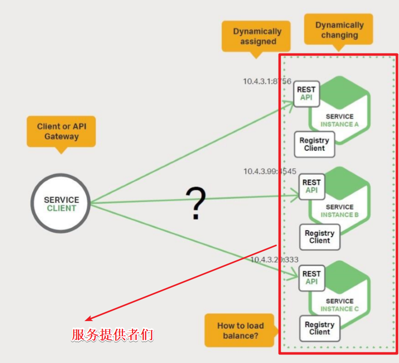

# study-hello-cloud
## 关于项目结构的一些注意点
我们在做电梯架构的时候,都是new Modules。但是在微服务架构下每个项目不是一个单独的服务。因为现在的开发模式并不是模块化开发,所以现在是创建目录继续进行开发。之前是一整个工程模块化,现在是每一个目录都是一个工程!

关于spring中#{}与${},可以这样联想记忆,"#"是四划"\$"是两划,#比\$牛逼啊,所以功能也更加强大,#中可以进行运算,而\$只能取值。

在mybatis中依旧是笔画多的牛皮,#{}能用来防止sql注入,而${}是纯粹的取值替换(包括''引号哦)!

## hello-spring-cloud-dependencies工程
Spring Cloud 项目都是基于 Spring Boot 进行开发，并且都是使用 Maven 做项目管理工具。在实际开发中，我们一般都会创建一个依赖管理项目作为 Maven 的 Parent 项目使用，这样做可以极大的方便我们对 Jar 包版本的统一管理。
### pom配置
```java
<?xml version="1.0" encoding="UTF-8"?>
<project xmlns="http://maven.apache.org/POM/4.0.0" xmlns:xsi="http://www.w3.org/2001/XMLSchema-instance"
         xsi:schemaLocation="http://maven.apache.org/POM/4.0.0 http://maven.apache.org/xsd/maven-4.0.0.xsd">
    <modelVersion>4.0.0</modelVersion>

    <parent>
        <groupId>org.springframework.boot</groupId>
        <artifactId>spring-boot-starter-parent</artifactId>
        <version>2.0.2.RELEASE</version>
    </parent>

    <groupId>com.funtl</groupId>
    <artifactId>hello-spring-cloud-dependencies</artifactId>
    <version>1.0.0-SNAPSHOT</version>
    <packaging>pom</packaging>

    <name>hello-spring-cloud-dependencies</name>
    <url>http://www.funtl.com</url>
    <inceptionYear>2018-Now</inceptionYear>

    <properties>
        <!-- Environment Settings -->
        <java.version>1.8</java.version>
        <project.build.sourceEncoding>UTF-8</project.build.sourceEncoding>
        <project.reporting.outputEncoding>UTF-8</project.reporting.outputEncoding>

        <!-- Spring Settings -->
        <spring-cloud.version>Finchley.RC1</spring-cloud.version>
    </properties>

    <dependencyManagement>
        <dependencies>
            <dependency>
                <groupId>org.springframework.cloud</groupId>
                <artifactId>spring-cloud-dependencies</artifactId>
                <version>${spring-cloud.version}</version>
                <type>pom</type>
                <scope>import</scope>
            </dependency>
        </dependencies>
    </dependencyManagement>

    <build>
        <plugins>
            <!-- Compiler 插件, 设定 JDK 版本 -->
            <plugin>
                <groupId>org.apache.maven.plugins</groupId>
                <artifactId>maven-compiler-plugin</artifactId>
                <configuration>
                    <showWarnings>true</showWarnings>
                </configuration>
            </plugin>

            <!-- 打包 jar 文件时，配置 manifest 文件，加入 lib 包的 jar 依赖 -->
            <plugin>
                <groupId>org.apache.maven.plugins</groupId>
                <artifactId>maven-jar-plugin</artifactId>
                <configuration>
                    <archive>
                        <addMavenDescriptor>false</addMavenDescriptor>
                    </archive>
                </configuration>
                <executions>
                    <execution>
                        <configuration>
                            <archive>
                                <manifest>
                                    <!-- Add directory entries -->
                                    <addDefaultImplementationEntries>true</addDefaultImplementationEntries>
                                    <addDefaultSpecificationEntries>true</addDefaultSpecificationEntries>
                                    <addClasspath>true</addClasspath>
                                </manifest>
                            </archive>
                        </configuration>
                    </execution>
                </executions>
            </plugin>

            <!-- resource -->
            <plugin>
                <groupId>org.apache.maven.plugins</groupId>
                <artifactId>maven-resources-plugin</artifactId>
            </plugin>

            <!-- install -->
            <plugin>
                <groupId>org.apache.maven.plugins</groupId>
                <artifactId>maven-install-plugin</artifactId>
            </plugin>

            <!-- clean -->
            <plugin>
                <groupId>org.apache.maven.plugins</groupId>
                <artifactId>maven-clean-plugin</artifactId>
            </plugin>

            <!-- ant -->
            <plugin>
                <groupId>org.apache.maven.plugins</groupId>
                <artifactId>maven-antrun-plugin</artifactId>
            </plugin>

            <!-- dependency -->
            <plugin>
                <groupId>org.apache.maven.plugins</groupId>
                <artifactId>maven-dependency-plugin</artifactId>
            </plugin>
        </plugins>

        <pluginManagement>
            <plugins>
                <!-- Java Document Generate -->
                <plugin>
                    <groupId>org.apache.maven.plugins</groupId>
                    <artifactId>maven-javadoc-plugin</artifactId>
                    <executions>
                        <execution>
                            <phase>prepare-package</phase>
                            <goals>
                                <goal>jar</goal>
                            </goals>
                        </execution>
                    </executions>
                </plugin>

                <!-- YUI Compressor (CSS/JS压缩) -->
                <plugin>
                    <groupId>net.alchim31.maven</groupId>
                    <artifactId>yuicompressor-maven-plugin</artifactId>
                    <version>1.5.1</version>
                    <executions>
                        <execution>
                            <phase>prepare-package</phase>
                            <goals>
                                <goal>compress</goal>
                            </goals>
                        </execution>
                    </executions>
                    <configuration>
                        <encoding>UTF-8</encoding>
                        <jswarn>false</jswarn>
                        <nosuffix>true</nosuffix>
                        <linebreakpos>30000</linebreakpos>
                        <force>true</force>
                        <includes>
                            <include>**/*.js</include>
                            <include>**/*.css</include>
                        </includes>
                        <excludes>
                            <exclude>**/*.min.js</exclude>
                            <exclude>**/*.min.css</exclude>
                        </excludes>
                    </configuration>
                </plugin>
            </plugins>
        </pluginManagement>

        <!-- 资源文件配置 -->
        <resources>
            <resource>
                <directory>src/main/java</directory>
                <excludes>
                    <exclude>**/*.java</exclude>
                </excludes>
            </resource>
            <resource>
                <directory>src/main/resources</directory>
            </resource>
        </resources>
    </build>

    <repositories>
        <repository>
            <id>aliyun-repos</id>
            <name>Aliyun Repository</name>
            <url>http://maven.aliyun.com/nexus/content/groups/public</url>
            <releases>
                <enabled>true</enabled>
            </releases>
            <snapshots>
                <enabled>false</enabled>
            </snapshots>
        </repository>

        <repository>
            <id>sonatype-repos</id>
            <name>Sonatype Repository</name>
            <url>https://oss.sonatype.org/content/groups/public</url>
            <releases>
                <enabled>true</enabled>
            </releases>
            <snapshots>
                <enabled>false</enabled>
            </snapshots>
        </repository>
        <repository>
            <id>sonatype-repos-s</id>
            <name>Sonatype Repository</name>
            <url>https://oss.sonatype.org/content/repositories/snapshots</url>
            <releases>
                <enabled>false</enabled>
            </releases>
            <snapshots>
                <enabled>true</enabled>
            </snapshots>
        </repository>

        <repository>
            <id>spring-snapshots</id>
            <name>Spring Snapshots</name>
            <url>https://repo.spring.io/snapshot</url>
            <snapshots>
                <enabled>true</enabled>
            </snapshots>
        </repository>
        <repository>
            <id>spring-milestones</id>
            <name>Spring Milestones</name>
            <url>https://repo.spring.io/milestone</url>
            <snapshots>
                <enabled>false</enabled>
            </snapshots>
        </repository>
    </repositories>

    <pluginRepositories>
        <pluginRepository>
            <id>aliyun-repos</id>
            <name>Aliyun Repository</name>
            <url>http://maven.aliyun.com/nexus/content/groups/public</url>
            <releases>
                <enabled>true</enabled>
            </releases>
            <snapshots>
                <enabled>false</enabled>
            </snapshots>
        </pluginRepository>
    </pluginRepositories>
</project>
```

- parent：继承了 Spring Boot 的 Parent，表示我们是一个 Spring Boot 工程
- package：pom，表示该项目仅当做依赖项目，没有具体的实现代码
- spring-cloud-dependencies：在 properties 配置中预定义了版本号为 Finchley.RC1 ，表示我们的 Spring Cloud 使用的是 F 版
- build：配置了项目所需的各种插件
- repositories：配置项目下载依赖时的第三方库

在实际开发中，我们所有的项目都会依赖这个 dependencies 项目，整个项目周期中的所有第三方依赖的版本也都由该项目进行管理。当我们创建好pom文件后还需要手动托管这个pom。
## 服务注册与发现中心
在这里，我们需要用的组件是 Spring Cloud Netflix 的 Eureka，Eureka 是一个服务注册和发现模块。服务注册与发现,是根据名字通过负载均衡来找服务的,所以项目必须有自己的名字。比如
```
spring:
  application:
    name: hello-spring-cloud-eureka
```

 值得注意的一点:eureka是纯正的 servlet 应用。

### 创建服务注册中心

```java
<?xml version="1.0" encoding="UTF-8"?>
<project xmlns="http://maven.apache.org/POM/4.0.0" xmlns:xsi="http://www.w3.org/2001/XMLSchema-instance"
         xsi:schemaLocation="http://maven.apache.org/POM/4.0.0 http://maven.apache.org/xsd/maven-4.0.0.xsd">
    <modelVersion>4.0.0</modelVersion>

    <parent>
        <groupId>com.funtl</groupId>
        <artifactId>hello-spring-cloud-dependencies</artifactId>
        <version>1.0.0-SNAPSHOT</version>
        <relativePath>../hello-spring-cloud-dependencies/pom.xml</relativePath>
    </parent>

    <artifactId>hello-spring-cloud-eureka</artifactId>
    <packaging>jar</packaging>

    <name>hello-spring-cloud-eureka</name>
    <url>http://www.funtl.com</url>
    <inceptionYear>2018-Now</inceptionYear>

    <dependencies>
        <!-- Spring Boot Begin -->
        <dependency>
            <groupId>org.springframework.boot</groupId>
            <artifactId>spring-boot-starter-test</artifactId>
            <scope>test</scope>
        </dependency>
        <!-- Spring Boot End -->

        <!-- Spring Cloud Begin -->
        <dependency>
            <groupId>org.springframework.cloud</groupId>
            <artifactId>spring-cloud-starter-netflix-eureka-server</artifactId>
        </dependency>
        <!-- Spring Cloud End -->
    </dependencies>

    <build>
        <plugins>
            <plugin>
                <groupId>org.springframework.boot</groupId>
                <artifactId>spring-boot-maven-plugin</artifactId>
                <configuration>
                    <mainClass>com.funtl.hello.spring.cloud.eureka.EurekaApplication</mainClass>
                </configuration>
            </plugin>
        </plugins>
    </build>
</project>
```
上面的pom中我们在插件中配置了入口类,问什么要这样呢?因为jar包(不单单是指spring-boot的jar文件)启动的时候一定要指定一个入口类,如果不指定,并且项目中有多于一个的main方法,jar包启动就会报错,jar包并不知道运行那个main方法。这就是为什么要指定入口类的原因。至于为什么配置了这个入口类就能解决这个问题,这就是我总结的4大学习方案的工具学习了!

### Application

启动一个服务注册中心，只需要一个注解 @EnableEurekaServer
```java
ackage com.funtl.hello.spring.cloud.eureka;

import org.springframework.boot.SpringApplication;
import org.springframework.boot.autoconfigure.SpringBootApplication;
import org.springframework.cloud.netflix.eureka.server.EnableEurekaServer;

@SpringBootApplication
@EnableEurekaServer
public class EurekaApplication {
    public static void main(String[] args) {
        SpringApplication.run(EurekaApplication.class, args);
    }
}
```

### application.yml
Eureka 是一个高可用的组件，它没有后端缓存，每一个实例注册之后需要向注册中心发送心跳（因此可以在内存中完成），在默认情况下 Erureka Server 也是一个 Eureka Client ,必须要指定一个 Server。
```java
spring:
  application:
    name: hello-spring-cloud-eureka

server:
  port: 8761

eureka:
  instance:
    hostname: localhost
  client:
    registerWithEureka: false
    fetchRegistry: false
    serviceUrl:
      defaultZone: http://${eureka.instance.hostname}:${server.port}/eureka/
```
通过 eureka.client.registerWithEureka:false 和 fetchRegistry:false 来表明自己是一个 Eureka Server.

### 操作界面
Eureka Server 是有界面的，启动工程，打开浏览器访问：
http://localhost:8761


## 服务提供者

当 Client 向 Server 注册时，它会提供一些元数据，例如主机和端口，URL，主页等。Eureka Server 从每个 Client 实例接收心跳消息。 如果心跳超时，则通常将该实例从注册 Server 中删除。



服务提供者能提供什么服务呢?当然不是特殊服务了!大部分都是增删改查服务啊!

总而言之本节内容就是教会我们创意一个--提供服务的--服务。

### POM

```text
<?xml version="1.0" encoding="UTF-8"?>
<project xmlns="http://maven.apache.org/POM/4.0.0" xmlns:xsi="http://www.w3.org/2001/XMLSchema-instance"
         xsi:schemaLocation="http://maven.apache.org/POM/4.0.0 http://maven.apache.org/xsd/maven-4.0.0.xsd">
    <modelVersion>4.0.0</modelVersion>

    <parent>
        <groupId>com.funtl</groupId>
        <artifactId>hello-spring-cloud-dependencies</artifactId>
        <version>1.0.0-SNAPSHOT</version>
        <relativePath>../hello-spring-cloud-dependencies/pom.xml</relativePath>
    </parent>

    <artifactId>hello-spring-cloud-service-admin</artifactId>
    <packaging>jar</packaging>

    <name>hello-spring-cloud-service-admin</name>
    <url>http://www.funtl.com</url>
    <inceptionYear>2018-Now</inceptionYear>

    <dependencies>
        <!-- Spring Boot Begin -->
        <dependency>
            <groupId>org.springframework.boot</groupId>
            <artifactId>spring-boot-starter-test</artifactId>
            <scope>test</scope>
        </dependency>
        <!-- Spring Boot End -->

        <!-- Spring Cloud Begin -->
        <dependency>
            <groupId>org.springframework.cloud</groupId>
            <artifactId>spring-cloud-starter-netflix-eureka-server</artifactId>
        </dependency>
        <!-- Spring Cloud End -->
    </dependencies>

    <build>
        <plugins>
            <plugin>
                <groupId>org.springframework.boot</groupId>
                <artifactId>spring-boot-maven-plugin</artifactId>
                <configuration>
                    <mainClass>com.funtl.hello.spring.cloud.service.admin.ServiceAdminApplication</mainClass>
                </configuration>
            </plugin>
        </plugins>
    </build>
</project>
```

### Application

通过注解 `@EnableEurekaClient` 表明自己是一个 Eureka Client.

```text
package com.funtl.hello.spring.cloud.service.admin;

import org.springframework.boot.SpringApplication;
import org.springframework.boot.autoconfigure.SpringBootApplication;
import org.springframework.cloud.netflix.eureka.EnableEurekaClient;

@SpringBootApplication
@EnableEurekaClient
public class ServiceAdminApplication {
    public static void main(String[] args) {
        SpringApplication.run(ServiceAdminApplication.class, args);
    }
}
```

### application.yml

```text
spring:
  application:
    name: hello-spring-cloud-service-admin

server:
  port: 8762

eureka:
  client:
    serviceUrl:
      defaultZone: http://localhost:8761/eureka/
```

**注意：** 需要指明 `spring.application.name`，这个很重要，这在以后的服务与服务之间相互调用一般都是根据这个 `name`